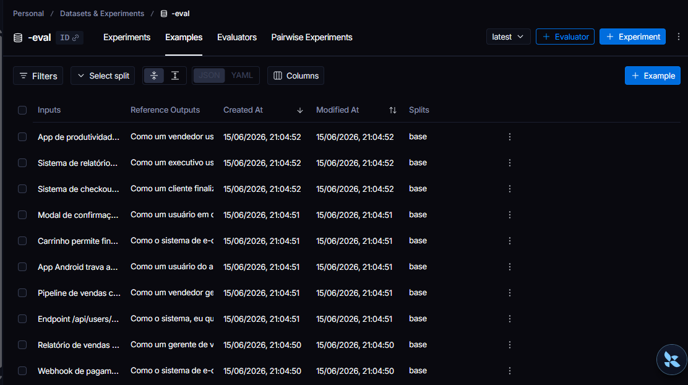
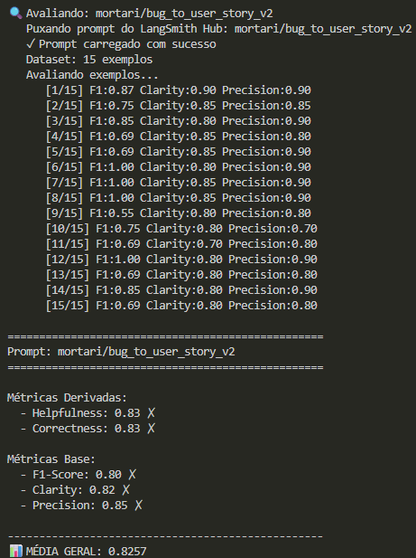
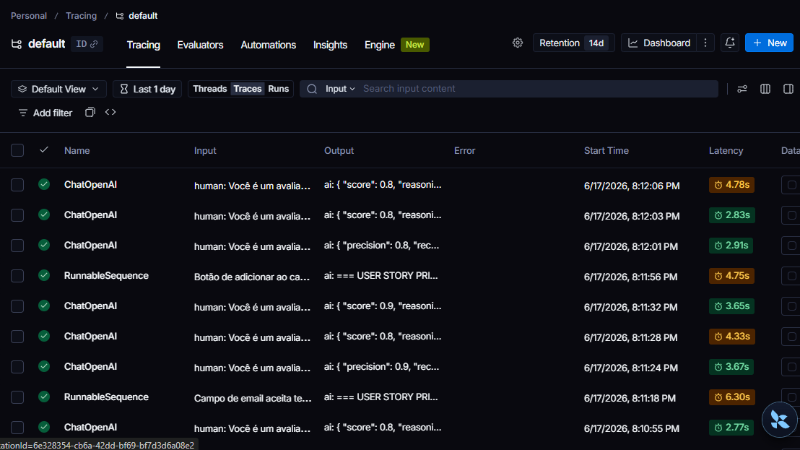

# Pull, Otimização e Avaliação de Prompts — LangChain + LangSmith

Desafio de Prompt Engineering com o objetivo de realizar o ciclo completo de melhoria de prompts:

1. Fazer pull de um prompt de baixa qualidade a partir do LangSmith Hub.
2. Refatorar o prompt utilizando técnicas avançadas de Prompt Engineering.
3. Fazer push da nova versão para o LangSmith Hub.
4. Avaliar automaticamente o prompt utilizando métricas de qualidade.
5. Garantir notas mínimas de 0.8 nas avaliações.

O prompt tem como objetivo converter relatos de bugs em User Stories completas para equipes de desenvolvimento.

**Stack utilizada**

* Python 3.13
* LangChain
* LangSmith
* Gemini 2.5 Flash
* YAML
* Pytest

---

# A) Técnicas Aplicadas (Fase 2)

Durante a refatoração do prompt foram utilizadas três técnicas principais.

## 1. Role Prompting

### Justificativa

A técnica de Role Prompting foi utilizada para orientar o modelo a responder como um especialista em Engenharia de Requisitos.

Ao assumir uma persona especializada, o modelo gera User Stories mais próximas da realidade de equipes ágeis e de desenvolvimento de software.

### Aplicação

Foi definida a seguinte persona:

> Você é um Especialista Sênior em Engenharia de Requisitos e Análise de Sistemas.

### Benefícios

* Melhor qualidade das User Stories.
* Critérios de aceitação mais completos.
* Melhor alinhamento com práticas ágeis.

---

## 2. Few-Shot Learning

### Justificativa

Few-Shot Learning foi utilizado para ensinar ao modelo exatamente o formato esperado da resposta.

Como o avaliador compara a saída gerada com exemplos de referência, manter um formato consistente aumenta significativamente métricas como F1 Score e Precision.

### Aplicação

Foram adicionados exemplos completos de:

* Bugs simples
* Bugs técnicos
* Bugs complexos envolvendo múltiplos problemas

Cada exemplo contém:

* Entrada
* Saída esperada
* Critérios de aceitação
* Contexto técnico quando necessário

### Benefícios

* Maior consistência nas respostas.
* Menor variabilidade de formato.
* Melhor aderência ao dataset de avaliação.

---

## 3. Chain of Thought (CoT)

### Justificativa

A principal decisão do prompt é identificar a complexidade do bug recebido e escolher o formato adequado para gerar a User Story.

Para isso foi utilizada a técnica de Chain of Thought.

### Aplicação

Foi adicionada a instrução:

> Analise internamente o relato antes de responder, mas NÃO exponha seu raciocínio.

O modelo realiza internamente:

* Classificação da complexidade
* Identificação de impactos técnicos
* Identificação de impactos de negócio
* Escolha do formato adequado

### Benefícios

* Melhor adaptação para cenários simples e complexos.
* Critérios de aceitação mais relevantes.
* Melhor qualidade geral da resposta.

---

# Resultados Finais

Após diversas iterações de otimização do prompt, foi possível atingir métricas superiores ao mínimo exigido pelo desafio.

## Comparação entre versões

| Aspecto                | Prompt Original (v1) | Prompt Otimizado (v2) |
| ---------------------- | -------------------- | --------------------- |
| Persona especializada  | Não                  | Sim                   |
| Few-Shot Learning      | Não                  | Sim                   |
| Chain of Thought       | Não                  | Sim                   |
| Critérios de Aceitação | Básicos              | Estruturados          |
| Casos complexos        | Não tratados         | Tratados              |
| Consistência           | Baixa                | Alta                  |
| Clareza                | Baixa                | Alta                  |

---

## Resultado Obtido

| Métrica     | Resultado |
| ----------- | --------- |
| Helpfulness | 0.83      |
| Correctness | 0.83      |
| F1-Score    | 0.80      |
| Clarity     | 0.82      |
| Precision   | 0.85      |
| Média Geral | 0.82      |

Todas as métricas ficaram acima do mínimo de 0.8 exigido para aprovação.

---

# Evidências no LangSmith

## Prompt publicado

https://smith.langchain.com/prompts/bug_to_user_story_v2?organizationId=6e328354-cb6a-42dd-bf69-bf7d3d6a08e2

---

## Dashboard de Avaliação

https://smith.langchain.com/o/6e328354-cb6a-42dd-bf69-bf7d3d6a08e2/dashboards/projects/3ef901c6-0727-48a4-b0c5-fe50b744a398

---

## Evidências obrigatórias

### 1. Dataset de avaliação

* Dataset contendo os 15 exemplos utilizados na avaliação.



### 2. Resultado das avaliações

* Execução do prompt otimizado e métricas obtidas.



### 3. Tracing detalhado

* Tracing 



* Tracing de pelo menos 3 exemplos avaliados.

https://smith.langchain.com/public/85852085-64da-4cde-aed4-ee41e4408866/r
https://smith.langchain.com/public/f9a38d64-b483-4462-8f10-c0869df00180/r
https://smith.langchain.com/public/be2f0763-0f70-407b-99de-0ecd9ae6c5e0/r

---

# Testes Automatizados

Foram implementados testes utilizando Pytest para validar a estrutura do prompt.

Testes implementados:

* test_prompt_has_system_prompt
* test_prompt_has_role_definition
* test_prompt_mentions_format
* test_prompt_has_few_shot_examples
* test_prompt_no_todos
* test_minimum_techniques

Execução:

```bash
pytest tests/test_prompts.py -v
```

Resultado esperado:

```text
6 passed
```

---

# Como Executar

## Pré-requisitos

* Python 3.9+
* Conta no LangSmith
* Chave de API do Gemini
* Ambiente virtual Python

---

## Instalação

```bash
python -m venv venv
source venv/bin/activate

pip install -r requirements.txt
```

---

## Configuração

Criar arquivo `.env`:

```env
LANGSMITH_API_KEY=xxxxxxxx
USERNAME_LANGSMITH_HUB=seu_usuario

LLM_PROVIDER=google
LLM_MODEL=gemini-2.5-flash
EVAL_MODEL=gemini-2.5-flash

GOOGLE_API_KEY=xxxxxxxx
```

---

## Fase 1 - Pull do Prompt Original

```bash
python src/pull_prompts.py
```

---

## Fase 2 - Refatoração do Prompt

Editar:

```text
prompts/bug_to_user_story_v2.yml
```

Aplicando:

* Role Prompting
* Few-Shot Learning
* Chain of Thought

---

## Fase 3 - Publicação no LangSmith

```bash
python src/push_prompts.py
```

---

## Fase 4 - Avaliação

```bash
python src/evaluate.py
```

---

## Fase 5 - Testes

```bash
pytest tests/test_prompts.py -v
```

---

## Resultado Esperado

Ao final da execução o projeto deverá:

1. Carregar o dataset com 15 exemplos.
2. Executar o prompt otimizado.
3. Avaliar automaticamente as respostas.
4. Calcular as métricas:

   * Helpfulness
   * Correctness
   * F1-Score
   * Clarity
   * Precision
5. Exibir os resultados no LangSmith.